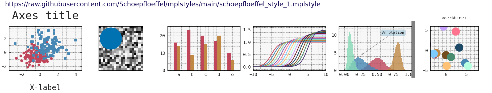
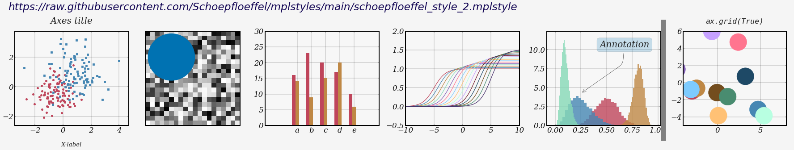

# mplstyles
mplstyles is a collection of customized [Matplotlib](http://matplotlib.org) style sheets (.mplstyle) that enable users to create beautiful, custom plots. These style sheets can be applied to any Matplotlib plot to change its appearance.

## :paintbrush: Usage
Using mplstyles is simple and straightforward. Just provide the GitHub link to the raw .mplstyle file, and Matplotlib and corresponding wrappers will take care of parsing and setting your rcParams.

```sh
import matplotlib.pyplot as plt
plt.style.use("https://raw.githubusercontent.com/Schoepfloeffel/mplstyles/main/schoepfloeffel_style_1.mplstyle") #rcParams are set
matplotlib.pyplot.plot([1, 2, 3], [1, 2, 3])
```

## :sparkles: Overview of style sheets

1. 'schoepfloeffel_style_1.mplstyle'
2. 'schoepfloeffel_style_2.mplstyle'


 
  
More style sheets will be added in the future.

## Example
The 'example' folder contains minimal examples that demonstrate how styles can be selected using various entry points (matplotlib, pyplot, seaborn). Under the hood, the 'rcParams' are set temporarily or permanently and will be evaluated during the plot rendering.

## References
For more details about customizing and .mplstyles, please refer to the [Customizing matplotlib plots](https://matplotlib.org/users/customizing.html).

